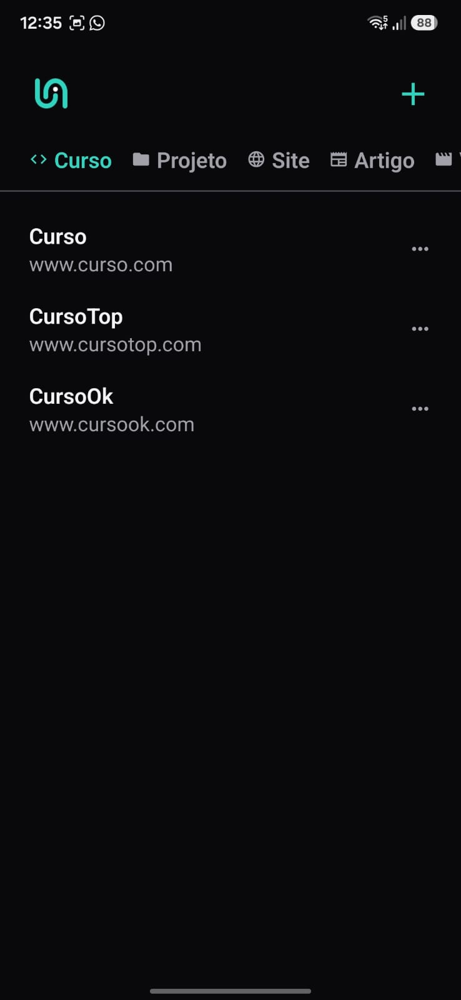
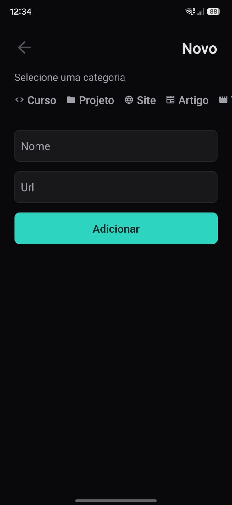
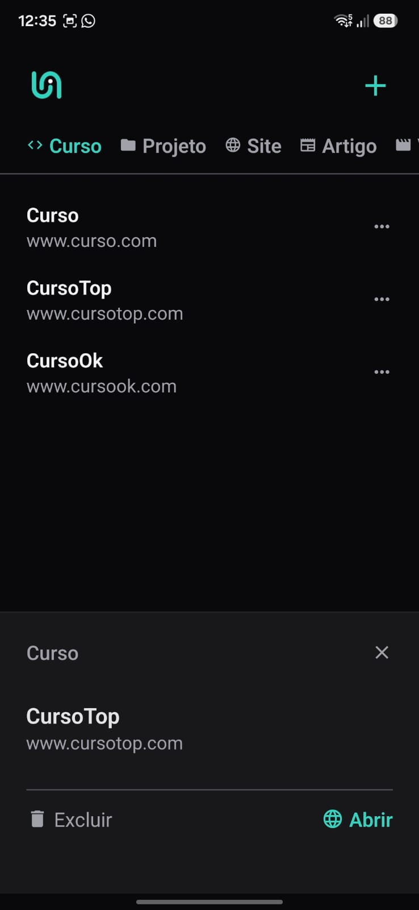

# Links

[](https://reactnative.dev/)
[](https://expo.dev/)
[](https://www.typescriptlang.org/)
[](LICENSE)

Versão em português do README. Para a versão em inglês, consulte [README.md](README.md).

## Sobre o projeto

Links é um aplicativo mobile desenvolvido com React Native e Expo para ajudar você a guardar links favoritos de forma organizada. O usuário pode adicionar novos links, categorizar cada item, abrir o link no navegador e excluir entradas quando necessário.

### ✨ Funcionalidades

- Adicionar links com nome, URL e categoria
- Organizar links por categoria
- Abrir links diretamente no navegador
- Excluir links salvos
- Persistência local usando AsyncStorage

### 📱 Capturas de tela







### 🛠️ Tecnologias utilizadas

- React Native
- Expo
- Expo Router
- TypeScript
- AsyncStorage
- React Native Vector Icons

### Requisitos

- Node.js 20+
- npm ou yarn
- Expo Go no celular, ou emulador Android/iOS

### 🚀 Instalação

1. Clone o repositório:

   ```bash
   git clone <seu-repositorio>
   cd app-links
   ```

2. Instale as dependências:

   ```bash
   npm install
   ```

3. Inicie o projeto:
   ```bash
   npx expo start
   ```

### 📁 Estrutura do projeto

```text
src/
  app/           # telas e rotas do aplicativo
  components/    # componentes reutilizáveis
  storage/       # lógica de persistência
  styles/        # temas e cores
  utils/         # utilidades e categorias
```

### 🤝 Contribuição

Contribuições são bem-vindas. Sinta-se à vontade para abrir uma issue ou enviar um pull request com melhorias.

### 📄 Licença

Este projeto está licenciado sob a licença MIT.
